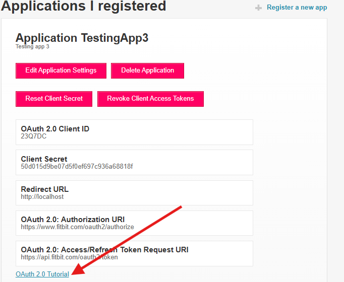
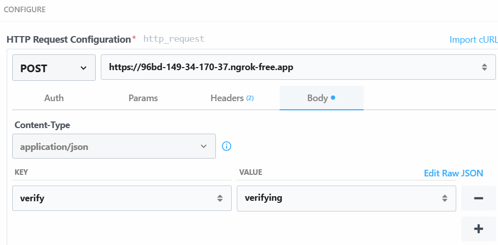
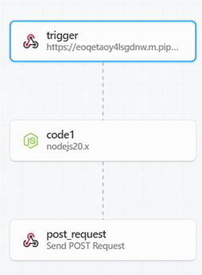

# Fitbit Data 
- [ActivityData](#FitbitActivityData)
- [AccelerometerData](#AccelerometerData)
Clone the repository to begin.

(Note: The server file is the same for accessing the fitbit activity data and accelerometer data)
## FitbitActivityData

This pulls activity data from Fitbit and stores it in SQL Server. It uses the Web API which is a REST API. 

### Installment Requirements

1. **Download Python (version > 3.10)**  
   [Link: Python Downloads](https://www.python.org/downloads/)

2. **Download ngrok**  
   [Link: ngrok Downloads](https://ngrok.com/downloads/windows?tab=download)

3. **Download SQL Server**  
   [Link: SQL Server Downloads](https://www.microsoft.com/en-gb/sql-server/sql-server-downloads)

4. **Download SQL Server Management Studio**  
   [Link: SSMS Downloads](https://learn.microsoft.com/en-us/sql/ssms/download-sql-server-management-studio-ssms?view=sql-server-ver16)

5. **Create Virtual Environment and download requirements**

- Create a virtual environment:  
  Linux/macOS:  

  ```bash
  python3 -m venv fitbitdata
  ``` 
  Windows:  
  ```bash
  python -m venv fitbitdata
  ```
   
- Activate the virtual environment in the fitbitdata folder:
  
  Linux/macOS:
  ```bash
  source bin/activate
  ```
  Windows:
  ```bash
   .\Scripts\activate
  ```  
- Once the environment has been activated install dependencies with pip from requirements.txt:
  
  ```bash
  pip install -r requirements.txt
  ```
- Deactivate the virtual environment when you're done:  

  ```bash 
  deactivate
  ```
6. **Fitbit mobile application**

### Account Requirements

1. **Fitbit Developer Account**  
   [Link: Fitbit Developer](https://dev.fitbit.com/)

2. **Pipedream Account**  
   [Link: Pipedream](https://pipedream.com/)

### Getting Started

#### 1) Register an App in Fitbit Developer Account 
An app allows consists of a client ID and secret which is used during the authorization process in order to access data from the Web API.

Use this link:[Link: Fitbit Developer](https://www.fitbit.com/dev)

In the upper right hand corner click on register an app. Provide the following details during the registration process:

- **Application Name**
- **Description**
- **Application Website URL**
- **Organization**
- **Organization Website URL**
- **Terms of Service URL**
- **Privacy Policy URL**
- **OAuth 2.0 Application Type**
- **Redirect URL**
- **Default Access Type**

**Note:** The URLs (except the Redirect URL) can be random.  
- Set **Redirect URL** to `http://localhost`
- Set **OAuth 2.0 Application Type** to `Personal`
- Set **Default Access Type** to `Read Only`

Example registration:


---

#### 2) Follow the OAuth 2.0 Tutorial to Get Access Keys

In order to access the data from the Web API the tokens for authorization are needed. The Fitbit uses Oauth2 to do this.
Follow the tutorial linked in the Fibit developer account to get the required access keys. It can be found as shown below:



---

#### 3) Create an ngrok Endpoint

- Run ngrok to expose port 80:

```bash
ngrok http 80
```

This will expose port 80, allowing it to receive requests from the Pipedream URL.

---


#### 4) Replace Keys and Server name in `initialScript.py`
This step creates the initial sql tables needed.

- Open `initialScript.py` and replace the key where indicated.
- Replace the server name where indicated.
- Run the script in the command line using the following command:

```bash
python initialScript.py
```

This should create the **Activities** database and the **Activity** table:


---

#### 5) Replace Key and Server name in `server.py`

- Open `server.py` and replace the key where indicated.
- Replace server name where indicated.
- Run the server script using the following command:

```bash
python server.py
```

---

#### 6) Create Pipedream workflow

- Create a new workflow in pipedream and add a new workflow when prompted

  

- Add a new HTTP/Webhook action to the workflow

 

- Configure the action as the following:

  

- Add a new NodeJS action.
- Configure the node action with the code provided in `nodejscode.txt`. You can find the `nodejscode.txt` file in the root directory of this repository.
- Add a new HTTP/Webhook action.
- Configure the action as the following, replacing the URL with the endpoint URL provided by ngrok:

    


- The final workflow should look like this (do not deploy workflow yet):

  


---

#### 7) Add and verify subscriber

- Edit the registered app on the Fitbit account  
- Add a subscriber to the app. The Endpoint URL of the suscriber should be the unique URL provided to trigger.

  

- Copy the verification code into the NodeJS action code in pipedream.  

  

- Deploy the Pipedream workflow.
- Click on verify on the Fitbit App to verify the subscriber.  

#### 8) Edit Activity Data Using Fitbit

- Complete an activity whilst wearing the Fitbit. Keep the Fitbit app open on your phone to immediately sync the data with your account.
- This should update the **Activity** table successfully.

## AccelerometerData

This pulls accelerometer data and stores it in a csv file. The app can also simulate accerometer data if using Fitbit OS Simulator. The app uses the Device API which has access to the sensors on the Fitbit devices. It also uses the Companion API to store data on a mobile device and transfer the data to a server.

### Installment Requirements

1. **Download NodeJS**
   [Link: NodeJS download](https://nodejs.org/en/download/)

2. **Download nvm**
   [Link: NVM Download](https://github.com/nvm-sh/nvm)

3. **Switch Node.js version to recommended version 14**
     ```bash
     nvm install 14
     nvm alias default 14
     ```
     Use --version to verify corrrect version 
     ```bash
     node --version 
     v14.21.3
     ```
### Account/Device Requirements

1. **Fitbit Developer Account**  
   [Link: Fitbit Developer](https://dev.fitbit.com/)
   
2. **Fitbit OS Device (Versa 1,Versa 2, Versa 3, Sense or Ionic) or you can download the Fitbit OS Simulator**
   [Link: Windows](https://simulator-updates.fitbit.com/download/stable/win)
   [Link: MacOS](https://simulator-updates.fitbit.com/download/stable/mac)

3. **If not using simulator, fitbit mobile application synced with the device is needed**

### Getting Started

#### 1) change directory to accerometer data using command "cd accelerometer-data"
#### 2) If you are not using a simulator enable the developer bridge by going to the settings on the watch and tapping developer bridge. Wait until it says Connected to Server.
#### 3) Run the server
        - Run the server script using the following command:

         ```bash
         python server.py
         ```
#### 4) Launch the interactive fitbit shell using command
        ```bash
        npx fitbit
        ```

        The command prompt should now display
        ```bash
        fitbit$
        ```
        Now that you are in the Fitbit shell type
        ```bash
        build
        ```
        Once that has run type
        ```bash
        install
        ```
      The app has now been installed on the Fitbit device/OS Simulator. You are now able to interact with the app and see the logs.

