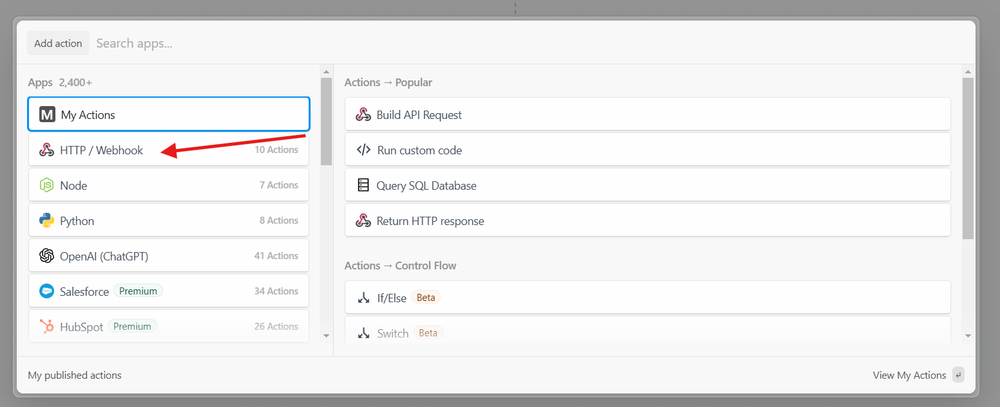
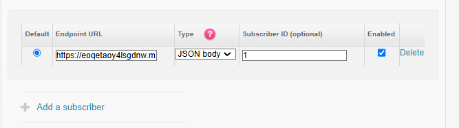
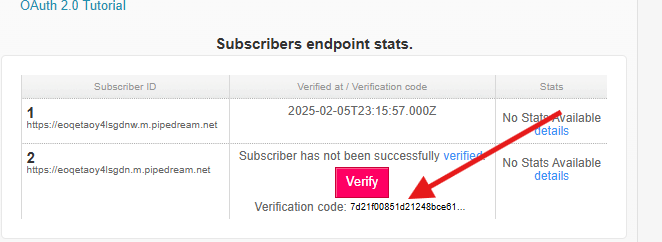

# FitbitActivityData

This repository pulls activity data from Fitbit and stores it in SQL Server.

## Installment Requirements

1. **Download Python (version > 3.10)**  
   [Link: Python Downloads](https://www.python.org/downloads/)

2. **Download ngrok**  
   [Link: ngrok Downloads](https://ngrok.com/downloads/windows?tab=download)

3. **Download SQL Server**  
   [Link: SQL Server Downloads](https://www.microsoft.com/en-gb/sql-server/sql-server-downloads)

4. **Download SQL Server Management Studio**  
   [Link: SSMS Downloads](https://learn.microsoft.com/en-us/sql/ssms/download-sql-server-management-studio-ssms?view=sql-server-ver16)

## Account Requirements

1. **Fitbit Developer Account**  
   [Link: Fitbit Developer](https://dev.fitbit.com/)

2. **Pipedream Account**  
   [Link: Pipedream](https://pipedream.com/)

## Getting Started

### 1) Register an App in Fitbit Developer Account

Provide the following details during the registration process:

- **Application Name**
- **Description**
- **Application Website URL**
- **Organization**
- **Organization Website URL**
- **Terms of Service URL**
- **Privacy Policy URL**
- **OAuth 2.0 Application Type**
- **Redirect URL**
- **Default Access Type**

**Note:** The URLs (except the Redirect URL) can be random.  
- Set **Redirect URL** to `http://localhost`
- Set **OAuth 2.0 Application Type** to `Personal`
- Set **Default Access Type** to `Read Only`

Example registration:


---

### 2) Follow the OAuth 2.0 Tutorial to Get Access Keys

Follow the tutorial linked in your Fitbit developer account to retrieve the required access keys:


---

### 3) Create an ngrok Endpoint

- Run ngrok to expose port 8000:

```bash
ngrok http 8000
```

This will expose port 80, allowing it to receive requests from the Pipedream URL.

---


### 4) Replace Keys in `initialScript.py`

- Open `initialScript.py` and replace the key where indicated.
- Run the script in the command line using the following command:

```bash
python initialScript.py
```

This should create the **Activities** database and the **Activity** table:


---

### 5) Replace Key in `server.py`

- Open `server.py` and replace the key where indicated.
- Run the server script using the following command:

```bash
python server.py
```

---

### 6) Create Pipedream workflow

- Create a new workflow in pipedream and add a new workflow when prompted

  

- Add a new HTTP/Webhook action to the workflow

 

- Configure the action as the following:

  

- Add a new NodeJS action.
- Configure the node action with the code provided in `nodejscode.txt`. You can find the `nodejscode.txt` file in the root directory of this repository.
- Add a new HTTP/Webhook action.
- Configure the action as the following, replacing the URL with the endpoint URL provided by ngrok:

    


- The final workflow should look like this (do not deploy workflow yet):

  


---

### 7) Add and verify subscriber

- Edit the registered app on the Fitbit account  
- Add a subscriber to the app. The Endpoint URL of the suscriber should be the unique URL provided to trigger.

  

- Copy the verification code into the NodeJS action code in pipedream.  

  

- Deploy the pipedream workflow.
- Click on verify on the Fitbit App to verify the subscriber.  

### 8) Edit Activity Data Using Fitbit

- Complete an activity and wear the Fitbit. Keep the Fitbit app open on your phone to immediately sync the data with your account.
- This should update the **Activity** table successfully.
