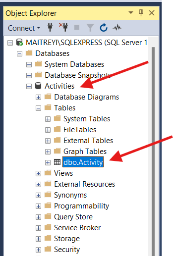

# FitbitActivityData
This repository pulls activity data from the Fitbit and stores it in SQL Server.

# Installment Requirements
Download python version >3.10  
Link:  
https://www.python.org/downloads/

Download ngrok  
Link:  
https://ngrok.com/downloads/windows?tab=download  

Download SQL Server  
Link:  
https://www.microsoft.com/en-gb/sql-server/sql-server-downloads  

Download SQL Server Management Studio  
Link:  
https://learn.microsoft.com/en-us/sql/ssms/download-sql-server-management-studio-ssms?view=sql-server-ver16

# Account Requirements
Fitbit developer account  
Link:  
https://dev.fitbit.com/

Pipedream account:  
Link:  
https://pipedream.com/

# Getting Started

1) Register an app in Fitbit developer account.   
Provide the:  

-Application Name  
-Description  
-Application Website URL  
-Organization  
-Organization Website URL  
-Terms of Service URL  
-Privacy Policy URL  
-OAuth 2.0 Application Type  
-Redirect URL  
-Default Access Type  

Note: The URLs except the Redirect URL can be random. Set the Redirect URL to http://localhost, the OAuth 2.0 Application Type to personal, and the Default Access Type to Read Only.  

For example:

  

2) Follow the OAuth 2.0 Tutorial to get the access keys

  

4) Run the initialScript in the command line using the command:

`python initialScript.py`  

This should create an activities database:

  

5) Run the server file using the command:

`python server.py`  
   
